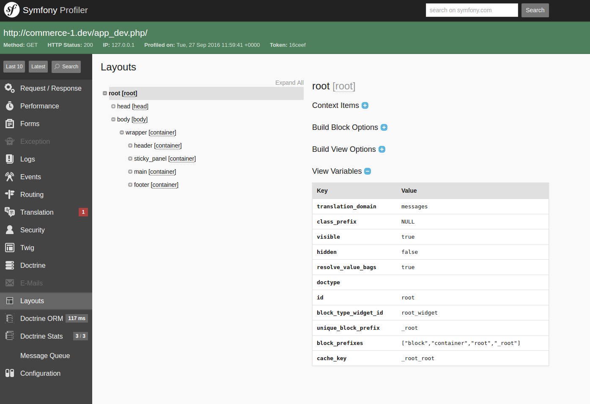
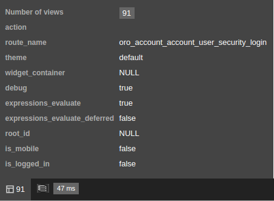

# Debug Information

## Symfony Profiler

The **Layout** section of the **Symfony Profiler** page contains:

 - **Layout Tree**
 - **Not Applied Actions**
 - **Context**
 
**IMPORTANT:** The [Layout data collector](../../DataCollector/LayoutDataCollector.php) collects debug information only if the layout cache is fresh. See the  [Layout cache](./layout_cache.md) section for more information.

### Layout Tree

The tree of **block views** with **block id** and **block type** is located in the left part of the **Layout Tree** section.

The right part of **Layout Tree** section contains information about the selected **block view**.

It contains the following blocks:

 - **Build Block Options** - collected when the [buildBlock](../../../../Component/Layout/BlockTypeExtensionInterface.php) method is triggered.
 - **Build View Options** - collected when the  [buildView](../../../../Component/Layout/BlockTypeExtensionInterface.php) method is triggered.
 - **View Variables** - [BlockView](../../../../Component/Layout/BlockView.php) vars



To disable the **Layout Tree** in the developer toolbar, navigate to `System - Configuration - Development Settings - Generate Layout Tree Dump For The Developer Toolbar`.

**IMPORTANT:** This options works only when the debug mode is enabled.

### Not Applied Actions

The **Not Applied Actions** section contains all actions that were not applied when generating the layout tree. 

## Developer Toolbar

The developer toolbar panel contains the icon that shows the **count of block views** for the current page. When you hover over the **count of block views**, it shows the **layout context items** information.



## Debug Layout Blocks

To enable **block debug information**, navigate to `System - Configuration - Development Settings - Include Block Debug Info Into HTML`.

Each block in HTML has data attributes:

- `data-layout-debug-block-id` - a unique identifier of the current block
- `data-layout-debug-block-template` - the template of the current block that was rendered

**IMPORTANT:** If you want to render block debug information in HTML, you need to define the `{{ block('block_attributes') }}` **for each twig block you have**.

**Example:**

```yaml
    ...
    
        <div{{ block('block_attributes') }}>
            {{ block_widget(block) }}
        </div>
    

    
        <header{{ block('block_attributes') }}>
            {{ block_widget(block) }}
        </header>
    
    ...
```


